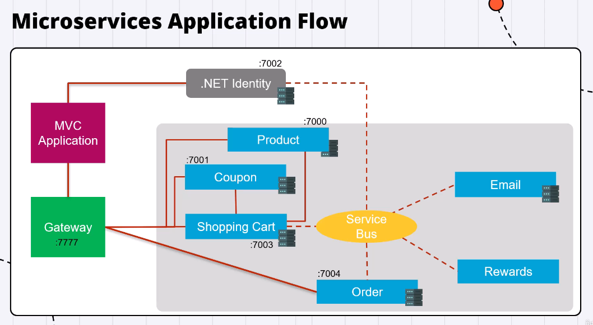

# MicroCommerce

.NET Core Ecommerce built on microservices architecture. This solution is a collection of several projects, each serving a specific purpose in the overall architecture. The solution is primarily written in C#, with some JavaScript. It uses the .NET 8.0 and .NET 7.0 frameworks.

## Projects

### Micro.GatewaySolution

This project is the gateway for the solution, providing a single entry point for all the services. It uses the following libraries:

- IdentityModel 6.2.0
- Microsoft.AspNetCore.Authentication.JwtBearer 8.0.1
- Ocelot 19.0.2

### Micro.Services.AuthAPI

This project handles authentication for the solution. It uses libraries such as:

- AutoMapper 12.0.1
- Microsoft.AspNetCore.Authentication.JwtBearer 8.0.0
- Microsoft.AspNetCore.Identity.EntityFrameworkCore 8.0.0
- Microsoft.EntityFrameworkCore 8.0.0
- Swashbuckle.AspNetCore 6.5.0

### Micro.Services.CouponAPI

This project manages coupons in the solution. It uses libraries such as:

- AspNetCore.HealthChecks.SqlServer 7.0.0
- AutoMapper 12.0.1
- Microsoft.AspNetCore.Authentication.JwtBearer 7.0.0
- Microsoft.EntityFrameworkCore 7.0.0
- Stripe.net 43.11.0

### Micro.Services.EmailAPI

This project handles email services for the solution. It uses libraries such as:

- AspNetCore.HealthChecks.SqlServer 7.0.0
- AutoMapper 12.0.1
- Azure.Messaging.ServiceBus 7.17.1
- Microsoft.AspNetCore.Authentication.JwtBearer 7.0.0
- Microsoft.EntityFrameworkCore 7.0.0
- Newtonsoft.Json 13.0.3

### Micro.Services.OrderAPI

This project manages orders in the solution. It uses libraries such as:

- AspNetCore.HealthChecks.SqlServer 7.0.0
- AutoMapper 12.0.1
- Microsoft.AspNetCore.Authentication.JwtBearer 7.0.0
- Microsoft.EntityFrameworkCore 7.0.0
- Newtonsoft.Json 13.0.3
- Stripe.net 43.10.0

### Micro.Services.ProductAPI

This project manages products in the solution. It uses libraries such as:

- AspNetCore.HealthChecks.SqlServer 7.0.0
- AutoMapper 12.0.1
- Microsoft.AspNetCore.Authentication.JwtBearer 7.0.0
- Microsoft.EntityFrameworkCore 7.0.0

### Micro.Services.RewardsAPI

This project manages rewards in the solution. It uses libraries such as:

- AspNetCore.HealthChecks.SqlServer 7.0.0
- AutoMapper 12.0.1
- Azure.Messaging.ServiceBus 7.17.1
- Microsoft.AspNetCore.Authentication.JwtBearer 7.0.0
- Microsoft.EntityFrameworkCore 7.0.0
- Stripe.net 43.11.0

### Micro.Services.ShoppingCartAPI

This project manages the shopping cart in the solution. It uses libraries such as:

- AspNetCore.HealthChecks.SqlServer 7.0.0
- AutoMapper 12.0.1
- Microsoft.AspNetCore.Authentication.JwtBearer 7.0.0
- Microsoft.EntityFrameworkCore 7.0.0
- Newtonsoft.Json 13.0.3

### Micro.Web

This project is the frontend for the solution. It uses libraries such as:

- IdentityModel 6.2.0
- Newtonsoft.Json 13.0.3

### Micro.MessageBus

This project handles messaging between services in the solution. It uses libraries such as:

- Azure.Messaging.ServiceBus 7.17.1
- Newtonsoft.Json 13.0.3

## Tools

The solution is developed using JetBrains Rider 2023.3.3 IDE and is intended to be run on a Windows operating system. Docker is also used, with a default target OS of Linux.
